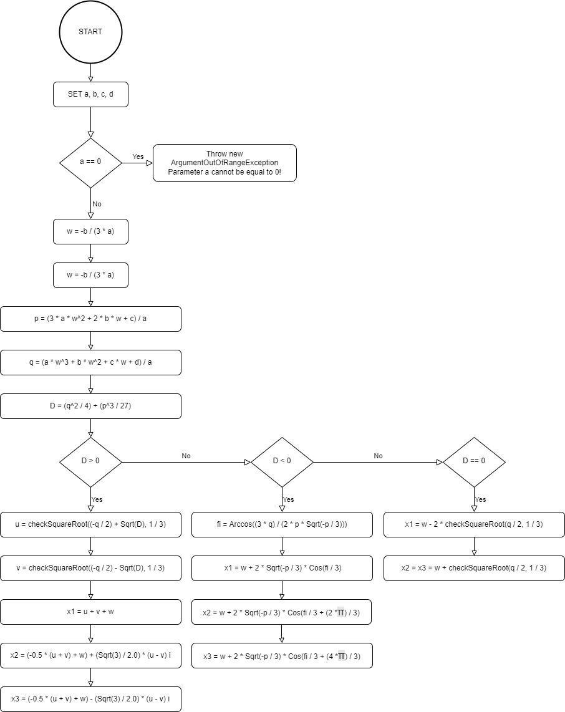

# Algorytmy i struktury danych

Zadania realizowane w ramach laboratoriów Algorytmy i struktury danych.

## Task 1 - CubicEquation

### Class usage example

**_If first given argument is equal to 0 then program throw argument out of range exception._**

```C#
 // dhelta > 0
Console.WriteLine(new CubicEquation(1, 2, 3, 4));

// dhelta < 0
Console.WriteLine(new CubicEquation(2, 9, 13, 6));
Console.WriteLine(new CubicEquation(1, -5, -2, 24));

// dhelta == 0
Console.WriteLine(new CubicEquation(1, 0, 0, 0));
```

### Class methods

#### public CubicEquation(double a, double b, double c, double d)

Class constructor, takes parameters to solve cubic equation.

**_If first given argument is equal to 0 then program throw argument out of range exception._**

#### private void Calculate()

Solves cubic equation and set properties x1, x2, x3.

#### private double checkSquareRoot(double x, double y)

Created for calculating real math square root of a negative number. Returns real square root.

#### public string ToString()

Returns x1, x2, x3 in text format

### Algorithm to solve cubic equation


